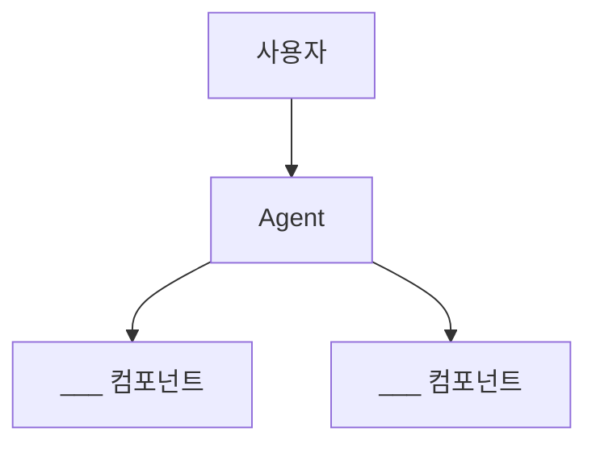

# 구조 설계 의사결정 문서

> 작성자: _______________
> 작성일: _______________
> Agent 이름: _______________

---

## 1. 기능 분석

### Agent 핵심 기능 목록

각 기능이 정보 검색(RAG)인지 작업 실행(Tool)인지 태깅하세요.

| # | 기능 | 설명 | RAG | Tool | 비고 |
|---|------|------|-----|------|------|
| 1 | | | [ ] | [ ] | |
| 2 | | | [ ] | [ ] | |
| 3 | | | [ ] | [ ] | |
| 4 | | | [ ] | [ ] | |
| 5 | | | [ ] | [ ] | |

### 요약

- RAG가 필요한 기능: ___개
- Tool이 필요한 기능: ___개
- 둘 다 필요한 기능: ___개

---

## 2. 의사결정 매트릭스

### 점수 부여 (0~10)

| 평가 항목 | 가중치 | RAG | Tool | Hybrid |
|----------|--------|-----|------|--------|
| 정보 검색 필요도 | 25% | /10 | /10 | /10 |
| 작업 실행 필요도 | 25% | /10 | /10 | /10 |
| 비용 효율성 | 20% | /10 | /10 | /10 |
| 구현 복잡도 (낮을수록 좋음) | 15% | /10 | /10 | /10 |
| 확장성 | 15% | /10 | /10 | /10 |

### 가중 합계 계산

```
RAG:    _×0.25 + _×0.25 + _×0.20 + _×0.15 + _×0.15 = ___
Tool:   _×0.25 + _×0.25 + _×0.20 + _×0.15 + _×0.15 = ___
Hybrid: _×0.25 + _×0.25 + _×0.20 + _×0.15 + _×0.15 = ___
```

### 점수 부여 근거

**정보 검색 필요도**:
_[점수를 이렇게 준 이유]_

**작업 실행 필요도**:
_[점수를 이렇게 준 이유]_

**비용 효율성**:
_[점수를 이렇게 준 이유]_

**구현 복잡도**:
_[점수를 이렇게 준 이유]_

**확장성**:
_[점수를 이렇게 준 이유]_

---

## 3. 구조 선택

### 선택한 구조

- [ ] RAG
- [ ] Tool (MCP / Function Calling)
- [ ] Hybrid (RAG + Tool)

### 선택 근거

_[최소 3문장으로 선택 이유를 논리적으로 설명]_

1. _[첫 번째 근거]_
2. _[두 번째 근거]_
3. _[세 번째 근거]_

---

## 4. 아키텍처 설계

### 구조 다이어그램



_[위 Mermaid를 실제 아키텍처에 맞게 수정하세요]_

### 주요 컴포넌트

| 컴포넌트 | 역할 | 기술 |
|---------|------|------|
| | | |
| | | |
| | | |

### 데이터 흐름 설명

_[사용자 요청이 들어왔을 때 어떤 순서로 처리되는지 2-3문장으로 설명]_

---

## 5. 비용 추정

### RAG 관련 비용 (해당 시)

```
임베딩 비용: ___ 건 × ___ 토큰 × $___/1M = $___/월
벡터 DB 비용: $___ /월
RAG LLM 비용: ___ 건 × ___ 토큰 × $___/1M = $___/월
```

### Tool 관련 비용 (해당 시)

```
도구 호출 LLM 비용: ___ 건 × ___ 회 × ___ 토큰 × $___/1M = $___/월
외부 API 비용: $___ /월
```

### 라우터 비용 (Hybrid인 경우)

```
라우터 LLM 비용: ___ 건 × ___ 토큰 × $___/1M = $___/월
```

### 월간 총 비용

```
총 비용: $___/월 (약 ___원)
```

---

## 6. 리스크 및 고려사항

### 선택한 구조의 약점

_[선택한 구조의 한계나 위험 요소를 2-3가지 적으세요]_

1. _[약점 1]_
2. _[약점 2]_
3. _[약점 3]_

### 대응 방안

_[각 약점에 대한 대응 전략]_

---

## 7. 향후 확장 계획 (선택)

_[현재 선택한 구조에서 향후 어떤 방향으로 확장할 수 있는지]_
