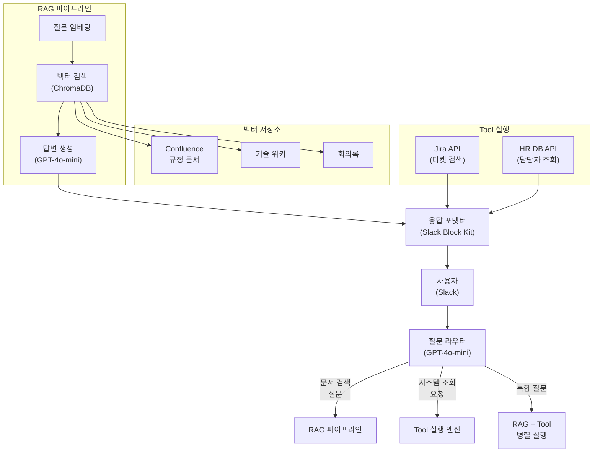

# 구조 설계 의사결정 문서 — 모범 답안 예시

> 작성자: 김강사
> 작성일: 2025-03-17
> Agent 이름: 사내 지식 검색 Agent

---

## 1. 기능 분석

### Agent 핵심 기능 목록

| # | 기능 | 설명 | RAG | Tool | 비고 |
|---|------|------|-----|------|------|
| 1 | 사내 규정 검색 | Confluence 규정 문서에서 답변 | [x] | [ ] | 핵심 기능 |
| 2 | 기술 위키 검색 | 개발 가이드/아키텍처 문서 검색 | [x] | [ ] | 핵심 기능 |
| 3 | Jira 티켓 검색 | 관련 이슈/결정 이력 조회 | [ ] | [x] | 실시간 API |
| 4 | 담당자 안내 | 부서/담당자 연락처 조회 | [ ] | [x] | HR DB 조회 |
| 5 | 회의록 검색 | 과거 회의록에서 결정사항 찾기 | [x] | [ ] | 문서 검색 |
| 6 | 출력 포맷팅 | 검색 결과를 Slack Block Kit으로 포맷 | [ ] | [x] | 응답 가공 |

### 요약

- RAG가 필요한 기능: 3개 (규정, 위키, 회의록)
- Tool이 필요한 기능: 3개 (Jira, HR DB, 포맷팅)
- 둘 다 필요한 기능: 0개

---

## 2. 의사결정 매트릭스

### 점수 부여 (0~10)

| 평가 항목 | 가중치 | RAG | Tool | Hybrid |
|----------|--------|-----|------|--------|
| 정보 검색 필요도 | 25% | 9 | 3 | 9 |
| 작업 실행 필요도 | 25% | 2 | 8 | 8 |
| 비용 효율성 | 20% | 8 | 6 | 5 |
| 구현 복잡도 (낮을수록 좋음) | 15% | 7 | 7 | 4 |
| 확장성 | 15% | 7 | 8 | 8 |

### 가중 합계 계산

```
RAG:    9×0.25 + 2×0.25 + 8×0.20 + 7×0.15 + 7×0.15 = 6.45
Tool:   3×0.25 + 8×0.25 + 6×0.20 + 7×0.15 + 8×0.15 = 6.20
Hybrid: 9×0.25 + 8×0.25 + 5×0.20 + 4×0.15 + 8×0.15 = 7.05
```

### 점수 부여 근거

**정보 검색 필요도**:
핵심 기능 3개(규정, 위키, 회의록)가 모두 문서 검색 기반이므로 RAG와 Hybrid에 9점. Tool은 Jira 검색만 해당하므로 3점.

**작업 실행 필요도**:
Jira API 호출과 HR DB 조회가 필요하여 Tool과 Hybrid에 8점. RAG는 검색만 하므로 2점 (출력 정도).

**비용 효율성**:
RAG만으로 핵심 60%를 커버하면 비용 대비 효율 좋음(8점). Tool은 매번 API 호출 비용(6점). Hybrid는 양쪽 비용 합산(5점).

**구현 복잡도**:
RAG(7점)와 Tool(7점)은 각각 구현이 비교적 단순. Hybrid는 라우터 + 양쪽 파이프라인으로 복잡(4점).

**확장성**:
Tool(8점)과 Hybrid(8점)는 새 도구/문서 추가가 용이. RAG(7점)는 문서 추가는 쉽지만 도구 추가 불가.

---

## 3. 구조 선택

### 선택한 구조

- [ ] RAG
- [ ] Tool (MCP / Function Calling)
- [x] Hybrid (RAG + Tool)

### 선택 근거

1. **핵심 기능의 절반이 문서 검색(RAG), 절반이 API 호출(Tool)이므로** 어느 한쪽만으로는 전체 기능을 커버할 수 없다. RAG만 선택하면 Jira/HR 조회가 불가하고, Tool만 선택하면 대량 문서 검색이 비효율적이다.

2. **매트릭스 점수에서 Hybrid(7.05)가 RAG(6.45)와 Tool(6.20)을 모두 상회**한다. 비용과 구현 복잡도에서 불리하지만, 정보 검색과 작업 실행 모두 높은 점수를 확보하여 기능 커버리지가 압도적이다.

3. **향후 확장성을 고려하면 Hybrid가 유리**하다. 새로운 문서 소스(Notion, Google Drive)는 RAG 파이프라인에 추가하고, 새로운 실행 기능(Slack 알림, 캘린더 조회)은 Tool로 추가하면 된다. 구조 변경 없이 양쪽 모두 확장 가능하다.

---

## 4. 아키텍처 설계

### 구조 다이어그램



### 주요 컴포넌트

| 컴포넌트 | 역할 | 기술 |
|---------|------|------|
| 질문 라우터 | 입력을 RAG/Tool/Hybrid로 분기 | GPT-4o-mini (Structured Output) |
| RAG 파이프라인 | 문서 검색 + 답변 생성 | ChromaDB + text-embedding-3-small + GPT-4o-mini |
| Tool 실행 엔진 | 외부 API 호출 | Jira REST API, HR DB API |
| 응답 포맷터 | Slack 메시지 구성 | Slack Block Kit |
| 벡터 저장소 | 문서 임베딩 저장 | ChromaDB (로컬) |

### 데이터 흐름 설명

사용자가 Slack에서 질문하면, 라우터(GPT-4o-mini)가 질문 유형을 판단하여 RAG/Tool/Hybrid 경로로 분기한다. RAG 경로에서는 ChromaDB에서 유사 문서를 검색하고 LLM이 답변을 생성한다. Tool 경로에서는 Jira/HR API를 직접 호출한다. 두 경로의 결과는 포맷터에서 Slack Block Kit 형태로 통합되어 사용자에게 전달된다.

---

## 5. 비용 추정

### RAG 관련 비용

```
초기 임베딩: 1,000문서 × 2,000토큰 × $0.02/1M = $0.04 (1회)
일간 신규 임베딩: 5문서 × 2,000토큰 × $0.02/1M = $0.0002/일
벡터 DB 비용: ChromaDB 로컬 = $0/월
RAG 답변 생성: 50건/일 × 0.6비율 × 2,000토큰 × $0.15/1M = $0.009/일
```

### Tool 관련 비용

```
Tool 호출 LLM: 50건/일 × 0.3비율 × 1,000토큰 × $0.15/1M = $0.00225/일
Jira API: 무료 (Cloud Basic)
HR DB: 내부 API (무료)
```

### 라우터 비용

```
라우터 LLM: 50건/일 × 200토큰 × $0.15/1M = $0.0015/일
```

### 월간 총 비용

```
RAG: $0.009 × 20일 = $0.18/월
Tool: $0.00225 × 20일 = $0.045/월
라우터: $0.0015 × 20일 = $0.03/월
임베딩 갱신: $0.0002 × 20일 = $0.004/월

총 비용: $0.26/월 (약 350원)
```

---

## 6. 리스크 및 고려사항

### 선택한 구조의 약점

1. **라우터 정확도**: 라우터가 질문 유형을 잘못 판단하면 엉뚱한 경로로 분기되어 부정확한 답변이 생성된다. 예: 규정 관련 질문을 Tool 경로로 보내면 답변 불가.

2. **문서 동기화**: Confluence 문서가 수정되면 벡터 DB의 임베딩도 갱신해야 한다. 동기화가 누락되면 구버전 정보로 답변하게 된다.

3. **구현 및 유지보수 복잡도**: RAG 파이프라인과 Tool 실행 엔진을 모두 구축하고 유지해야 하므로, 단일 구조 대비 개발/운영 부담이 2배에 가깝다.

### 대응 방안

1. **라우터 개선**: 라우터에 Few-shot 예시를 제공하고, 신뢰도 점수를 함께 반환하도록 설계. 신뢰도 0.7 미만이면 양쪽 모두 실행(Hybrid 경로).

2. **자동 동기화**: Confluence Webhook으로 문서 변경을 감지하고, 변경된 문서만 재임베딩하는 증분 파이프라인 구축. 일 1회 전체 재색인 배치도 운영.

3. **점진적 구현**: MVP에서는 RAG만 구현하고(1주), v1.0에서 Tool 추가(2주), v1.5에서 Hybrid 라우터 도입(3주)하여 복잡도를 단계적으로 관리.

---

## 7. 향후 확장 계획

**단기 (1-2개월)**:
- Notion, Google Drive 문서를 RAG 파이프라인에 추가
- Slack 대화 이력 검색 기능 추가

**중기 (3-6개월)**:
- 사용자별 질문 이력 기반 개인화 (Stateful 전환 검토)
- 자주 묻는 질문 자동 학습 → FAQ 자동 생성

**장기 (6개월+)**:
- Multi-Agent 구조로 확장 (검색 Agent + 실행 Agent + 요약 Agent)
- 음성 인터페이스 (Slack Huddle → Speech-to-Text → Agent)
